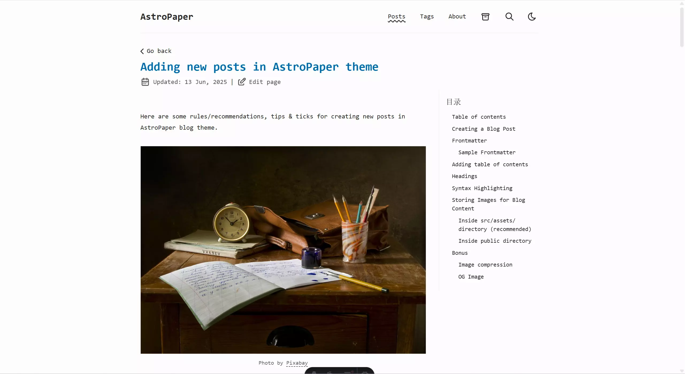

AstroPaper is a highly customizable Astro blog theme. With AstroPaper, you can customize everything according to your personal taste. This article will explain how you can make some customizations easily in the config file.

## Table of contents

## 1、创建Astro-paper项目

> 本博客使用Astro-paper主题搭建。

### 1.2 安装依赖

``` bash
# install dependencies if you haven't done so in the previous step.
pnpm install
```

### 1.3 运行项目

``` bash
# start running the project
pnpm run dev
```

### 1.4 运行项目 

``` bash
pnpm run dev
```
> 查看search（搜索功能）是否成功。

## 2、部署项目

``` bash
echo "# Astro-paper_CN" >> README.md
git init
git add README.md
git commit -m "first commit"
git branch -M main
git remote add origin https://github.com/用户名/仓库名.git
git push -u origin main
```
> 注：如果是git clone下载astro-paper，记得删除项目里的.git文件。

## 3、配置主题

### 3.1 配置文章页面布局
> 双栏布局：左文章，右目录。



#### 3.1.1 新建toc.css

``` css file=./src/style/toc.css
/* 目录样式 */
/* 文章布局调整为两栏 */
@media (min-width: 1024px) {
  .post-content-wrapper {
    display: flex;
    gap: 2rem;
    position: relative;
  }

  /* 文章内容区域调整 */
  .post-content-wrapper #article {
    flex: 1;
    max-width: calc(100% - 280px);
  }

  /* 隐藏文章中原有的目录 */
  .post-content-wrapper #article details summary:has(+ ul li a[href^="#"]) {
    display: none;
  }
  
  .post-content-wrapper #article details:has(summary:contains("Table of contents")) {
    display: none;
  }

  /* 右侧边栏容器 */
  .right-sidebar {
    width: 250px;
    position: sticky;
    top: 20px;
    align-self: flex-start;
    max-height: calc(100vh - 40px);
    overflow-y: auto;
    padding: 1rem;
    border-left: 1px solid var(--color-border);
    font-size: 0.9rem;
  }

  /* 目录标题样式 */
  .right-sidebar h2 {
    font-size: 1.2rem;
    margin-top: 0;
    margin-bottom: 0.75rem;
  }

  /* 目录列表样式 */
  .right-sidebar ul {
    padding-left: 1rem;
  }

  .right-sidebar li {
    margin-bottom: 0.5rem;
  }

  .right-sidebar a {
    color: var(--color-foreground);
    text-decoration: none;
    transition: color 0.2s;
  }

  .right-sidebar a:hover {
    color: var(--color-accent);
  }
  
  /* 隐藏文章中的目录 */
  #article h2:has(+ details):has(summary:contains("Table of contents")),
  #article details:has(summary:contains("Table of contents")) {
    display: none;
  }
}

/* 移动端不显示右侧边栏 */
@media (max-width: 1023px) {
  .right-sidebar {
    display: none;
  }
}
```

#### 3.1.2 引入toc.css
``` css file=./src/style/global.css
@import "./toc.css";
```

#### 3.1.3 修改PostDetails.astro
``` astro file=./src/layouts/PostDetails.astro
---
import { render, type CollectionEntry } from "astro:content";
import Layout from "@/layouts/Layout.astro";
import Header from "@/components/Header.astro";
import Footer from "@/components/Footer.astro";
import Tag from "@/components/Tag.astro";
import Datetime from "@/components/Datetime.astro";
import EditPost from "@/components/EditPost.astro";
import ShareLinks from "@/components/ShareLinks.astro";
import BackButton from "@/components/BackButton.astro";
import BackToTopButton from "@/components/BackToTopButton.astro";
import { getPath } from "@/utils/getPath";
import { slugifyStr } from "@/utils/slugify";
import IconChevronLeft from "@/assets/icons/IconChevronLeft.svg";
import IconChevronRight from "@/assets/icons/IconChevronRight.svg";
import { SITE } from "@/config";

export interface Props {
  post: CollectionEntry<"blog">;
  posts: CollectionEntry<"blog">[];
}

const { post, posts } = Astro.props;

const {
  title,
  author,
  description,
  ogImage: initOgImage,
  canonicalURL,
  pubDatetime,
  modDatetime,
  timezone,
  tags,
  hideEditPost,
} = post.data;

const { Content } = await render(post);

let ogImageUrl: string | undefined;

// Determine OG image source
if (typeof initOgImage === "string") {
  ogImageUrl = initOgImage; // Remote OG image (absolute URL)
} else if (initOgImage?.src) {
  ogImageUrl = initOgImage.src; // Local asset
}

// Use dynamic OG image if enabled and no remote|local ogImage
if (!ogImageUrl && SITE.dynamicOgImage) {
  ogImageUrl = `${getPath(post.id, post.filePath)}/index.png`;
}

// Resolve OG image URL (or fallback to SITE.ogImage / default `og.png`)
const ogImage = ogImageUrl
  ? new URL(ogImageUrl, Astro.url.origin).href
  : undefined;

const layoutProps = {
  title: `${title} | ${SITE.title}`,
  author,
  description,
  pubDatetime,
  modDatetime,
  canonicalURL,
  ogImage,
  scrollSmooth: true,
};

/* ========== Prev/Next Posts ========== */

const allPosts = posts.map(({ data: { title }, id, filePath }) => ({
  id,
  title,
  filePath,
}));

const currentPostIndex = allPosts.findIndex(a => a.id === post.id);

const prevPost = currentPostIndex !== 0 ? allPosts[currentPostIndex - 1] : null;
const nextPost =
  currentPostIndex !== allPosts.length ? allPosts[currentPostIndex + 1] : null;
---

<Layout {...layoutProps}>
  <Header />
  <BackButton />
  <main
    id="main-content"
    class:list={[
      "mx-auto w-full max-w-app px-4 pb-12",
      { "mt-8": !SITE.showBackButton },
    ]}
    data-pagefind-body
  >
    <h1
      transition:name={slugifyStr(title)}
      class="inline-block text-2xl font-bold text-accent sm:text-3xl"
    >
      {title}
    </h1>
    <div class="my-2 flex items-center gap-2">
      <Datetime {pubDatetime} {modDatetime} {timezone} size="lg" />
      <span
        aria-hidden="true"
        class:list={[
          "max-sm:hidden",
          { hidden: !SITE.editPost.enabled || hideEditPost },
        ]}>|</span
      >
      <EditPost {hideEditPost} {post} class="max-sm:hidden" />
    </div>
    /* [!code --:6] */
    <article
      id="article"
      class="app-prose mx-auto mt-8 max-w-app prose-pre:bg-(--shiki-light-bg) dark:prose-pre:bg-(--shiki-dark-bg)"
    >
      <Content />
    </article>
    
    /* [!code ++:13] */
    <div class="post-content-wrapper">
      <article
        id="article"
        class="app-prose mx-auto mt-8 prose-pre:bg-(--shiki-light-bg) dark:prose-pre:bg-(--shiki-dark-bg)"
      >
        <Content />
      </article>
      
      <div class="right-sidebar">
        <h2>目录</h2>
        <div id="toc-content"></div>
      </div>
    </div>

    <hr class="my-8 border-dashed" />

    <EditPost class="sm:hidden" {hideEditPost} {post} />

    <ul class="mt-4 mb-8 sm:my-8">
      {tags.map(tag => <Tag tag={slugifyStr(tag)} tagName={tag} />)}
    </ul>

    <BackToTopButton />

    <ShareLinks />

    <hr class="my-6 border-dashed" />

    <!-- Previous/Next Post Buttons -->
    <div data-pagefind-ignore class="grid grid-cols-1 gap-6 sm:grid-cols-2">
      {
        prevPost && (
          <a
            href={getPath(prevPost.id, prevPost.filePath)}
            class="flex w-full gap-1 hover:opacity-75"
          >
            <IconChevronLeft class="inline-block flex-none rtl:rotate-180" />
            <div>
              <span>上一篇 文章</span>
              <div class="text-sm text-accent/85">{prevPost.title}</div>
            </div>
          </a>
        )
      }
      {
        nextPost && (
          <a
            href={getPath(nextPost.id, nextPost.filePath)}
            class="flex w-full justify-end gap-1 text-end hover:opacity-75 sm:col-start-2"
          >
            <div>
              <span>下一篇 文章</span>
              <div class="text-sm text-accent/85">{nextPost.title}</div>
            </div>
            <IconChevronRight class="inline-block flex-none rtl:rotate-180" />
          </a>
        )
      }
    </div>
  </main>
  <Footer />
</Layout>

<script is:inline data-astro-rerun>
  /** Create a progress indicator
   *  at the top */
  function createProgressBar() {
    // Create the main container div
    const progressContainer = document.createElement("div");
    progressContainer.className =
      "progress-container fixed top-0 z-10 h-1 w-full bg-background";

    // Create the progress bar div
    const progressBar = document.createElement("div");
    progressBar.className = "progress-bar h-1 w-0 bg-accent";
    progressBar.id = "myBar";

    // Append the progress bar to the progress container
    progressContainer.appendChild(progressBar);

    // Append the progress container to the document body or any other desired parent element
    document.body.appendChild(progressContainer);
  }
  createProgressBar();

  /** Update the progress bar
   *  when user scrolls */
  function updateScrollProgress() {
    document.addEventListener("scroll", () => {
      const winScroll =
        document.body.scrollTop || document.documentElement.scrollTop;
      const height =
        document.documentElement.scrollHeight -
        document.documentElement.clientHeight;
      const scrolled = (winScroll / height) * 100;
      if (document) {
        const myBar = document.getElementById("myBar");
        if (myBar) {
          myBar.style.width = scrolled + "%";
        }
      }
    });
  }
  updateScrollProgress();

  /** Attaches links to headings in the document,
   *  allowing sharing of sections easily */
  function addHeadingLinks() {
    const headings = Array.from(
      document.querySelectorAll("h2, h3, h4, h5, h6")
    );
    for (const heading of headings) {
      heading.classList.add("group");
      const link = document.createElement("a");
      link.className =
        "heading-link ms-2 no-underline opacity-75 md:opacity-0 md:group-hover:opacity-100 md:focus:opacity-100";
      link.href = "#" + heading.id;

      const span = document.createElement("span");
      span.ariaHidden = "true";
      span.innerText = "#";
      link.appendChild(span);
      heading.appendChild(link);
    }
  }
  addHeadingLinks();

  /** Attaches copy buttons to code blocks in the document,
   * allowing users to copy code easily. */
  function attachCopyButtons() {
    const copyButtonLabel = "Copy";
    const codeBlocks = Array.from(document.querySelectorAll("pre"));

    for (const codeBlock of codeBlocks) {
      const wrapper = document.createElement("div");
      wrapper.style.position = "relative";

      // Check if --file-name-offset custom property exists
      const computedStyle = getComputedStyle(codeBlock);
      const hasFileNameOffset =
        computedStyle.getPropertyValue("--file-name-offset").trim() !== "";

      // Determine the top positioning class
      const topClass = hasFileNameOffset
        ? "top-(--file-name-offset)"
        : "-top-3";

      const copyButton = document.createElement("button");
      copyButton.className = `copy-code absolute end-3 ${topClass} rounded bg-muted border border-muted px-2 py-1 text-xs leading-4 text-foreground font-medium`;
      copyButton.innerHTML = copyButtonLabel;
      codeBlock.setAttribute("tabindex", "0");
      codeBlock.appendChild(copyButton);

      // wrap codebock with relative parent element
      codeBlock?.parentNode?.insertBefore(wrapper, codeBlock);
      wrapper.appendChild(codeBlock);

      copyButton.addEventListener("click", async () => {
        await copyCode(codeBlock, copyButton);
      });
    }

    async function copyCode(block, button) {
      const code = block.querySelector("code");
      const text = code?.innerText;

      await navigator.clipboard.writeText(text ?? "");

      // visual feedback that task is completed
      button.innerText = "Copied";

      setTimeout(() => {
        button.innerText = copyButtonLabel;
      }, 700);
    }
  }
  attachCopyButtons();

  /* Go to page start after page swap */
  document.addEventListener("astro:after-swap", () =>
    window.scrollTo({ left: 0, top: 0, behavior: "instant" })
  );
  
  /* [!code ++:87] */
  // 提取文章中的目录并显示在右侧边栏
  function extractTableOfContents() {
    const article = document.getElementById("article");
    const tocContent = document.getElementById("toc-content");
    
    if (!article || !tocContent) return;
    
    // 清空目录内容，避免重复
    tocContent.innerHTML = "";
    
    // 查找文章中的目录
    const tocDetails = Array.from(article.querySelectorAll("details")).find(
      details => {
        const summary = details.querySelector("summary");
        return summary && summary.textContent?.trim() === "Table of contents";
      }
    );
    
    // 先隐藏所有可能的目录元素
    Array.from(article.querySelectorAll("details")).forEach(details => {
      const summary = details.querySelector("summary");
      if (summary && summary.textContent?.trim() === "Table of contents") {
        details.style.display = "none";
      }
    });
    
    if (tocDetails) {
      // 复制目录内容到右侧边栏
      const tocList = tocDetails.querySelector("ul");
      if (tocList) {
        // 复制目录内容
        const clonedList = tocList.cloneNode(true);
        
        // 移除所有 # 符号
        Array.from(clonedList.querySelectorAll("a")).forEach(link => {
          // 移除链接文本中的 # 符号
          link.textContent = link.textContent?.replace(/#/g, "").trim();
        });
        
        tocContent.appendChild(clonedList);
      }
    } else {
      // 如果没有找到目录，则生成一个基于标题的目录
      const headings = Array.from(article.querySelectorAll("h2, h3, h4")).filter(
        heading => {
          const headingText = heading.textContent?.trim() || "";
          return headingText !== "Table of contents";
        }
      );
      
      if (headings.length > 0) {
        const ul = document.createElement("ul");
        
        headings.forEach(heading => {
          const li = document.createElement("li");
          const a = document.createElement("a");
          
          // 创建锚点ID（如果没有）
          if (!heading.id) {
            heading.id = heading.textContent?.trim().toLowerCase().replace(/\s+/g, "-") || "";
          }
          
          a.href = `#${heading.id}`;
          // 移除标题文本中的 # 符号
          a.textContent = heading.textContent?.replace(/#/g, "").trim();
          
          // 根据标题级别添加缩进
          if (heading.tagName === "H3") {
            li.style.paddingLeft = "1rem";
          } else if (heading.tagName === "H4") {
            li.style.paddingLeft = "2rem";
          }
          
          li.appendChild(a);
          ul.appendChild(li);
        });
        
        tocContent.appendChild(ul);
      }
    }
  }
  
  // 在每次页面加载完成后提取目录
  document.addEventListener("astro:page-load", extractTableOfContents);
  
  // 确保在页面切换时也能正确处理目录
  document.addEventListener("astro:after-swap", extractTableOfContents);
</script>
```

### 3.2 配置目录的折叠功能
> 配置右侧目录的折叠功能，如果文章目录多可以配置该功能。

#### 3.2.1 修改toc.css
> 直接复制文件，覆盖toc.css即可
``` css file=./src/style/toc.css
/* 目录样式 */
/* 文章布局调整为两栏 */
@media (min-width: 1024px) {
  .post-content-wrapper {
    display: flex;
    gap: 2rem;
    position: relative;
  }

  /* 文章内容区域调整 */
  .post-content-wrapper #article {
    flex: 1;
    max-width: calc(100% - 280px);
  }

  /* 隐藏文章中原有的目录 */
  .post-content-wrapper #article details summary:has(+ ul li a[href^="#"]) {
    display: none;
  }
  
  .post-content-wrapper #article details:has(summary:contains("Table of contents")) {
    display: none;
  }

  /* 右侧边栏容器 */
  .right-sidebar {
    width: 250px;
    position: sticky;
    top: 20px;
    align-self: flex-start;
    max-height: calc(100vh - 40px);
    overflow-y: auto;
    padding: 1rem;
    border-left: 1px solid var(--color-border);
    font-size: 0.9rem;
  }

  /* 目录标题样式 */
  .right-sidebar h2 {
    font-size: 1.2rem;
    margin-top: 0;
    margin-bottom: 0.75rem;
  }

  /* 目录列表样式 */
  .right-sidebar ul {
    padding-left: 1.25rem;
    list-style: none;
    margin: 0;
  }

  /* 目录项基本样式 */
  .right-sidebar li {
    position: relative;
    margin-bottom: 0.5rem;
    line-height: 1.5;
  }
  
  /* 目录链接样式 */
  .right-sidebar a {
    color: var(--color-foreground);
    text-decoration: none;
    transition: color 0.2s;
    display: inline-block;
  }

  .right-sidebar a:hover {
    color: var(--color-accent);
  }
  
  /* 目录折叠功能样式 */
  .right-sidebar li.has-children {
    position: relative;
  }
  
  /* 默认隐藏子列表 */
  .right-sidebar li.has-children > ul {
    display: none;
  }
  
  /* 展开时显示子列表 */
  .right-sidebar li.has-children.expanded > ul {
    display: block;
  }
  
  /* 折叠按钮样式 */
  .right-sidebar .toggle-btn {
    position: absolute;
    left: -1.25rem;
    top: 0.25rem;
    width: 16px;
    height: 16px;
    cursor: pointer;
    display: inline-flex;
    align-items: center;
    justify-content: center;
    transform: rotate(0deg);
    transition: transform 0.2s ease;
  }
  
  /* 折叠状态下箭头指向右侧 */
  .right-sidebar li:not(.expanded) > .toggle-btn {
    transform: rotate(0deg);
  }
  
  /* 展开状态下箭头指向下方 */
  .right-sidebar li.expanded > .toggle-btn {
    transform: rotate(90deg);
  }
  
  /* 隐藏文章中的目录 */
  #article h2:has(+ details):has(summary:contains("Table of contents")),
  #article details:has(summary:contains("Table of contents")) {
    display: none;
  }
}

/* 移动端不显示右侧边栏 */
@media (max-width: 1023px) {
  .right-sidebar {
    display: none;
  }
}
```

#### 3.2.2 修改PostDetails.astro
> 直接复制文件，覆盖PostDetails.astro即可。
``` astro file=./src/layouts/PostDetails.astro
---
import { render, type CollectionEntry } from "astro:content";
import Layout from "@/layouts/Layout.astro";
import Header from "@/components/Header.astro";
import Footer from "@/components/Footer.astro";
import Tag from "@/components/Tag.astro";
import Datetime from "@/components/Datetime.astro";
import EditPost from "@/components/EditPost.astro";
import ShareLinks from "@/components/ShareLinks.astro";
import BackButton from "@/components/BackButton.astro";
import BackToTopButton from "@/components/BackToTopButton.astro";
import { getPath } from "@/utils/getPath";
import { slugifyStr } from "@/utils/slugify";
import IconChevronLeft from "@/assets/icons/IconChevronLeft.svg";
import IconChevronRight from "@/assets/icons/IconChevronRight.svg";
import { SITE } from "@/config";

export interface Props {
  post: CollectionEntry<"blog">;
  posts: CollectionEntry<"blog">[];
}

const { post, posts } = Astro.props;

const {
  title,
  author,
  description,
  ogImage: initOgImage,
  canonicalURL,
  pubDatetime,
  modDatetime,
  timezone,
  tags,
  hideEditPost,
} = post.data;

const { Content } = await render(post);

let ogImageUrl: string | undefined;

// Determine OG image source
if (typeof initOgImage === "string") {
  ogImageUrl = initOgImage; // Remote OG image (absolute URL)
} else if (initOgImage?.src) {
  ogImageUrl = initOgImage.src; // Local asset
}

// Use dynamic OG image if enabled and no remote|local ogImage
if (!ogImageUrl && SITE.dynamicOgImage) {
  ogImageUrl = `${getPath(post.id, post.filePath)}/index.png`;
}

// Resolve OG image URL (or fallback to SITE.ogImage / default `og.png`)
const ogImage = ogImageUrl
  ? new URL(ogImageUrl, Astro.url.origin).href
  : undefined;

const layoutProps = {
  title: `${title} | ${SITE.title}`,
  author,
  description,
  pubDatetime,
  modDatetime,
  canonicalURL,
  ogImage,
  scrollSmooth: true,
};

/* ========== Prev/Next Posts ========== */

const allPosts = posts.map(({ data: { title }, id, filePath }) => ({
  id,
  title,
  filePath,
}));

const currentPostIndex = allPosts.findIndex(a => a.id === post.id);

const prevPost = currentPostIndex !== 0 ? allPosts[currentPostIndex - 1] : null;
const nextPost =
  currentPostIndex !== allPosts.length ? allPosts[currentPostIndex + 1] : null;
---

<Layout {...layoutProps}>
  <Header />
  <BackButton />
  <main
    id="main-content"
    class:list={[
      "mx-auto w-full max-w-app px-4 pb-12",
      { "mt-8": !SITE.showBackButton },
    ]}
    data-pagefind-body
  >
    <h1
      transition:name={slugifyStr(title)}
      class="inline-block text-2xl font-bold text-accent sm:text-3xl"
    >
      {title}
    </h1>
    <div class="my-2 flex items-center gap-2">
      <Datetime {pubDatetime} {modDatetime} {timezone} size="lg" />
      <span
        aria-hidden="true"
        class:list={[
          "max-sm:hidden",
          { hidden: !SITE.editPost.enabled || hideEditPost },
        ]}>|</span
      >
      <EditPost {hideEditPost} {post} class="max-sm:hidden" />
    </div>
    <div class="post-content-wrapper">
      <article
        id="article"
        class="app-prose mx-auto mt-0 prose-pre:bg-(--shiki-light-bg) dark:prose-pre:bg-(--shiki-dark-bg)"
      >
        <Content />
      </article>
      
      <div class="right-sidebar">
        <h2>目录</h2>
        <div id="toc-content"></div>
      </div>
    </div>

    <hr class="my-8 border-dashed" />

    <EditPost class="sm:hidden" {hideEditPost} {post} />

    <ul class="mt-4 mb-8 sm:my-8">
      {tags.map((tag: string) => <Tag tag={slugifyStr(tag)} tagName={tag} />)}
    </ul>

    <BackToTopButton />

    <ShareLinks />

    <hr class="my-6 border-dashed" />

    <!-- Previous/Next Post Buttons -->
    <div data-pagefind-ignore class="grid grid-cols-1 gap-6 sm:grid-cols-2">
      {
        prevPost && (
          <a
            href={getPath(prevPost.id, prevPost.filePath)}
            class="flex w-full gap-1 hover:opacity-75"
          >
            <IconChevronLeft class="inline-block flex-none rtl:rotate-180" />
            <div>
              <span>Previous Post</span>
              <div class="text-sm text-accent/85">{prevPost.title}</div>
            </div>
          </a>
        )
      }
      {
        nextPost && (
          <a
            href={getPath(nextPost.id, nextPost.filePath)}
            class="flex w-full justify-end gap-1 text-end hover:opacity-75 sm:col-start-2"
          >
            <div>
              <span>Next Post</span>
              <div class="text-sm text-accent/85">{nextPost.title}</div>
            </div>
            <IconChevronRight class="inline-block flex-none rtl:rotate-180" />
          </a>
        )
      }
    </div>
  </main>
  <Footer />
</Layout>

<script is:inline data-astro-rerun>
  /** Create a progress indicator
   *  at the top */
  function createProgressBar() {
    // Create the main container div
    const progressContainer = document.createElement("div");
    progressContainer.className =
      "progress-container fixed top-0 z-10 h-1 w-full bg-background";

    // Create the progress bar div
    const progressBar = document.createElement("div");
    progressBar.className = "progress-bar h-1 w-0 bg-accent";
    progressBar.id = "myBar";

    // Append the progress bar to the progress container
    progressContainer.appendChild(progressBar);

    // Append the progress container to the document body or any other desired parent element
    document.body.appendChild(progressContainer);
  }
  createProgressBar();

  /** Update the progress bar
   *  when user scrolls */
  function updateScrollProgress() {
    document.addEventListener("scroll", () => {
      const winScroll =
        document.body.scrollTop || document.documentElement.scrollTop;
      const height =
        document.documentElement.scrollHeight -
        document.documentElement.clientHeight;
      const scrolled = (winScroll / height) * 100;
      if (document) {
        const myBar = document.getElementById("myBar");
        if (myBar) {
          myBar.style.width = scrolled + "%";
        }
      }
    });
  }
  updateScrollProgress();

  /** Attaches links to headings in the document,
   *  allowing sharing of sections easily */
  function addHeadingLinks() {
    const headings = Array.from(
      document.querySelectorAll("h2, h3, h4, h5, h6")
    );
    for (const heading of headings) {
      heading.classList.add("group");
      const link = document.createElement("a");
      link.className =
        "heading-link ms-2 no-underline opacity-75 md:opacity-0 md:group-hover:opacity-100 md:focus:opacity-100";
      link.href = "#" + heading.id;

      const span = document.createElement("span");
      span.ariaHidden = "true";
      span.innerText = "#";
      link.appendChild(span);
      heading.appendChild(link);
    }
  }
  addHeadingLinks();

  /** Attaches copy buttons to code blocks in the document,
   * allowing users to copy code easily. */
  function attachCopyButtons() {
    const copyButtonLabel = "Copy";
    const codeBlocks = Array.from(document.querySelectorAll("pre"));

    for (const codeBlock of codeBlocks) {
      const wrapper = document.createElement("div");
      wrapper.style.position = "relative";

      // Check if --file-name-offset custom property exists
      const computedStyle = getComputedStyle(codeBlock);
      const hasFileNameOffset =
        computedStyle.getPropertyValue("--file-name-offset").trim() !== "";

      // Determine the top positioning class
      const topClass = hasFileNameOffset
        ? "top-(--file-name-offset)"
        : "-top-3";

      const copyButton = document.createElement("button");
      copyButton.className = `copy-code absolute end-3 ${topClass} rounded bg-muted border border-muted px-2 py-1 text-xs leading-4 text-foreground font-medium`;
      copyButton.innerHTML = copyButtonLabel;
      codeBlock.setAttribute("tabindex", "0");
      codeBlock.appendChild(copyButton);

      // wrap codebock with relative parent element
      codeBlock?.parentNode?.insertBefore(wrapper, codeBlock);
      wrapper.appendChild(codeBlock);

      copyButton.addEventListener("click", async () => {
        await copyCode(codeBlock, copyButton);
      });
    }

    async function copyCode(block, button) {
      const code = block.querySelector("code");
      const text = code?.innerText;

      await navigator.clipboard.writeText(text ?? "");

      // visual feedback that task is completed
      button.innerText = "Copied";

      setTimeout(() => {
        button.innerText = copyButtonLabel;
      }, 700);
    }
  }
  attachCopyButtons();

  /* Go to page start after page swap */
  document.addEventListener("astro:after-swap", () =>
    window.scrollTo({ left: 0, top: 0, behavior: "instant" })
  );
  
  // 提取文章中的目录并显示在右侧边栏，支持折叠功能
  function extractTableOfContents() {
    const article = document.getElementById("article");
    const tocContent = document.getElementById("toc-content");
    
    if (!article || !tocContent) return;
    
    // 清空目录内容，避免重复
    tocContent.innerHTML = "";
    
    // 查找文章中的目录
    const tocDetails = Array.from(article.querySelectorAll("details")).find(
      details => {
        const summary = details.querySelector("summary");
        return summary && summary.textContent?.trim() === "Table of contents";
      }
    );
    
    // 先隐藏所有可能的目录元素
    Array.from(article.querySelectorAll("details")).forEach(details => {
      const summary = details.querySelector("summary");
      if (summary && summary.textContent?.trim() === "Table of contents") {
        details.style.display = "none";
      }
    });
    
    if (tocDetails) {
      // 复制目录内容到右侧边栏
      const tocList = tocDetails.querySelector("ul");
      if (tocList) {
        // 处理目录内容，添加折叠功能
        createCollapsibleToc(tocList, tocContent);
      }
    } else {
      // 如果没有找到目录，则生成一个基于标题的目录
      const headings = Array.from(article.querySelectorAll("h2, h3, h4")).filter(
        heading => {
          const headingText = heading.textContent?.trim() || "";
          return headingText !== "Table of contents";
        }
      );
      
      if (headings.length > 0) {
        // 创建目录并添加折叠功能
        createTocFromHeadings(headings, tocContent);
      }
    }
  }
  
  // 从现有目录创建可折叠目录
  function createCollapsibleToc(tocList, tocContent) {
    // 复制目录内容
    const clonedList = tocList.cloneNode(true);
    
    // 移除所有 # 符号
    Array.from(clonedList.querySelectorAll("a")).forEach(link => {
      // 移除链接文本中的 # 符号
      if (link.textContent) {
        link.textContent = link.textContent.replace(/#/g, "").trim();
      }
    });
    
    // 处理目录项，添加折叠功能
    processListItems(clonedList);
    
    tocContent.appendChild(clonedList);
  }
  
  // 从标题创建可折叠目录
  function createTocFromHeadings(headings, tocContent) {
    const ul = document.createElement("ul");
    
    // 跟踪当前的标题级别和父元素
    let currentLevel = 2; // 从h2开始
    let currentParent = ul;
    let parentStack = [ul];
    
    headings.forEach(heading => {
      const headingLevel = parseInt(heading.tagName.charAt(1));
      const li = document.createElement("li");
      const a = document.createElement("a");
      
      // 创建锚点ID（如果没有）
      if (!heading.id) {
        heading.id = heading.textContent?.trim().toLowerCase().replace(/\s+/g, "-") || "";
      }
      
      a.href = `#${heading.id}`;
      
      // 移除标题文本中的 # 符号
      if (heading.textContent) {
        a.textContent = heading.textContent.replace(/#/g, "").trim();
      } else {
        a.textContent = "";
      }
      
      li.appendChild(a);
      
      // 处理嵌套
      if (headingLevel > currentLevel) {
        // 创建新的子列表
        const newUl = document.createElement("ul");
        
        // 添加折叠功能
        const lastLi = currentParent.lastElementChild;
        if (lastLi) {
          lastLi.classList.add("has-children");
          const toggleBtn = document.createElement("span");
          toggleBtn.className = "toggle-btn";
          toggleBtn.innerHTML = '<svg xmlns="http://www.w3.org/2000/svg" viewBox="0 0 24 24" width="16" height="16"><path d="M12 16L6 10H18L12 16Z" fill="currentColor"/></svg>';
          lastLi.insertBefore(toggleBtn, lastLi.firstChild);
          
          lastLi.appendChild(newUl);
          
          // 添加点击事件
          toggleBtn.addEventListener("click", function(e) {
            e.preventDefault();
            e.stopPropagation();
            this.parentElement.classList.toggle("expanded");
          });
        }
        
        currentParent = newUl;
        parentStack.push(newUl);
        currentLevel = headingLevel;
      } else if (headingLevel < currentLevel) {
        // 回到上一级
        const steps = currentLevel - headingLevel;
        for (let i = 0; i < steps; i++) {
          parentStack.pop();
        }
        currentParent = parentStack[parentStack.length - 1];
        currentLevel = headingLevel;
      }
      
      currentParent.appendChild(li);
    });
    
    // 处理目录项，添加折叠功能
    processListItems(ul);
    
    tocContent.appendChild(ul);
  }
  
  // 处理目录项，添加折叠功能
  function processListItems(ul) {
    // 使用更高效的选择器直接找到有子目录的项
    const itemsWithChildren = ul.querySelectorAll("li:has(ul)");
    
    itemsWithChildren.forEach(item => {
      // 移除所有已存在的箭头和按钮，防止重叠
      const existingArrows = item.querySelectorAll(".toggle-btn");
      existingArrows.forEach(arrow => arrow.remove());
      
      // 有子目录的项添加可折叠功能
      item.classList.add("has-children");
      
      // 添加折叠按钮
      const toggleBtn = document.createElement("span");
      toggleBtn.className = "toggle-btn";
      // 使用箭头样式
      toggleBtn.innerHTML = '<svg xmlns="http://www.w3.org/2000/svg" viewBox="0 0 24 24" width="16" height="16"><path d="M10 6L8.59 7.41 13.17 12l-4.58 4.59L10 18l6-6-6-6z" fill="currentColor"/></svg>';
      
      // 添加点击事件
      toggleBtn.addEventListener("click", function(e) {
        e.preventDefault();
        e.stopPropagation();
        this.parentElement.classList.toggle("expanded");
      });
      
      // 添加按钮到最前面
      item.insertBefore(toggleBtn, item.firstChild);
    });
  }
      
  // 在每次页面加载完成后提取目录
  document.addEventListener("astro:page-load", extractTableOfContents);
  
  // 确保在页面切换时也能正确处理目录
  document.addEventListener("astro:after-swap", extractTableOfContents);

</script>
```

### 3.3 配置代码块
> 设置代码行和代码块的响应式宽度

#### 3.3.1 新建code.css
``` css file=./src/styles/code.css
/* 限制代码块高度，超出部分显示滚动条 */
pre {
  max-height: 300px; 
  overflow-y: auto;
  overflow-x: auto;
} 

/* 添加对代码块里长代码行的处理 */
pre code {
  white-space: pre;         /* 不换行 */
  word-wrap: normal;        /* 不允许长单词换行 */
  overflow-wrap: normal;    /* 不允许单词换行 */
}

/* 处理details标签内的代码块 */
details pre {
  width: 100%;
}

details pre code {
  white-space: pre;         /* 不换行 */
  word-wrap: normal;        /* 不允许长单词换行 */
  overflow-wrap: normal;    /* 不允许单词换行 */
  width: 100%;
}

/* 强制折叠代码块与其他代码块宽度一致 */
details .astro-code {
  min-width: 100% !important;
  display: block !important;
}

/* 修复折叠代码块的父容器宽度 */
details {
  width: 100% !important;
  display: block !important;
}

/* 代码块行号显示 */
pre {
  counter-reset: line;
}

pre code .line {
  counter-increment: line;
  position: relative;
  padding-left: 2rem;
}

pre code .line::before {
  content: counter(line);
  position: absolute;
  left: 0;
  text-align: right;
  color: #666;
  font-size: 1em;
} 
```
#### 3.3.2 引入code.css

``` css file=./src/styles/global.css
@import "./code.css";
```

### 3.4 配置BackToTopButton
> 配置返回顶部组件的下划进度条样式逻辑，以适应不同移动端设备。</br>
> 注：如果你不常用移动端或者没有强迫症可以不用配置。

``` js
---
import IconChevronLeft from "@/assets/icons/IconChevronLeft.svg";
import IconArrowNarrowUp from "@/assets/icons/IconArrowNarrowUp.svg";
---

<div
  id="btt-btn-container"
  class:list={[
    "fixed end-4 bottom-8 z-50",
    "md:sticky md:end-auto md:float-end md:me-1",
    "translate-y-14 opacity-0 transition duration-500",
  ]}
>
  <button
    data-button="back-to-top"
    class:list={[
      "group relative bg-background px-2 py-1",
      "size-14 rounded-full shadow-xl",
      "md:h-8 md:w-fit md:rounded-md md:shadow-none md:focus-visible:rounded-none",
      "md:bg-background/35 md:bg-clip-padding md:backdrop-blur-lg",
    ]}
  >
    <span
      id="progress-indicator"
      class="absolute inset-0 -z-10 block size-14 scale-110 rounded-full bg-transparent md:hidden md:h-8 md:rounded-md"
    ></span>
    <IconChevronLeft class="inline-block rotate-90 md:hidden" />
    <span class="sr-only text-sm group-hover:text-accent md:not-sr-only">
      <IconArrowNarrowUp class="inline-block size-4" />
      Back To Top
    </span>
  </button>
</div>

<script is:inline data-astro-rerun>
  /** Scrolls the document to the top when
   * the "Back to Top" button is clicked. */
  function backToTop() {
    const rootElement = document.documentElement;
    const btnContainer = document.querySelector("#btt-btn-container");
    const backToTopBtn = document.querySelector("[data-button='back-to-top']");
    const progressIndicator = document.querySelector("#progress-indicator");

    if (!rootElement || !btnContainer || !backToTopBtn || !progressIndicator)
      return;

    // Attach click event handler for back-to-top button
    backToTopBtn.addEventListener("click", () => {
      document.body.scrollTop = 0; // For Safari
      document.documentElement.scrollTop = 0; // For Chrome, Firefox, IE and Opera
    });

    // Handle button visibility according to scroll position
    let lastVisible = null;
    function handleScroll() {
      const scrollTotal = rootElement.scrollHeight - rootElement.clientHeight;
      const scrollTop = rootElement.scrollTop;
      /* [!code --:1] */
      const scrollPercent = Math.floor((scrollTop / scrollTotal) * 100);

      /* [!code ++:7] */
      // 修改计算方式，确保在页面底部时能达到100%
      let scrollPercent = Math.min(100, Math.floor((scrollTop / scrollTotal) * 100));
      
      //如果滚动到接近底部（例如95%以上），则强制设为100%以确保圆圈完整
      if (scrollPercent > 98.5) {
        scrollPercent = 100;
      }


      progressIndicator.style.setProperty(
        "background-image",
        `conic-gradient(var(--accent), var(--accent) ${scrollPercent}%, transparent ${scrollPercent}%)`
      );

      //配置下拉到页面的百分比时出现返回顶部的组件（0.3=30%，推荐改为0.1）
      const isVisible = scrollTop / scrollTotal > 0.3;

      if (isVisible !== lastVisible) {
        btnContainer.classList.toggle("opacity-100", isVisible);
        btnContainer.classList.toggle("translate-y-0", isVisible);
        btnContainer.classList.toggle("opacity-0", !isVisible);
        btnContainer.classList.toggle("translate-y-14", !isVisible);
        lastVisible = isVisible;
      }
    }

    let ticking = false;
    document.addEventListener("scroll", () => {
      if (!ticking) {
        window.requestAnimationFrame(() => {
          handleScroll();
          ticking = false;
        });
        ticking = true;
      }
    });
  }
  backToTop();
</script>
```

### 3.5 禁止右滑触发返回
> 主要防止移动端浏览代码块时向右滑动导致触发返回

#### 3.5.1 新建disable-swipe-navigation.js

> 新版disable-swipe-navigation.js (推荐)
- 预加载
- 高性能
``` js file=./public/disable-swipe-navigation.js
// 禁用滑动导航手势
(function() {
  // 初始触摸位置
  let startX = 0;
  let startY = 0;
  let isScrolling = false;
  let threshold = 30; // 增加阈值，使检测更精确
  
  // 监听触摸开始事件
  document.addEventListener('touchstart', function(e) {
    // 记录初始触摸位置
    startX = e.touches[0].clientX;
    startY = e.touches[0].clientY;
    isScrolling = false;
  }, { passive: true }); // 改为passive: true提高性能
  
  // 监听触摸移动事件
  document.addEventListener('touchmove', function(e) {
    if (e.touches.length > 1) return; // 忽略多点触控
    
    const currentX = e.touches[0].clientX;
    const currentY = e.touches[0].clientY;
    const deltaX = currentX - startX;
    const deltaY = currentY - startY;
    
    // 只在屏幕左侧边缘开始的向右滑动时阻止默认行为
    if (Math.abs(deltaX) > Math.abs(deltaY) && !isScrolling) {
      // 只有当起始点在屏幕左侧边缘(50px内)且是向右滑动时才阻止
      if (startX < 50 && deltaX > threshold) {
        e.preventDefault();
      }
    } else {
      isScrolling = true;
    }
  }, { passive: false });
  
  // 预加载链接，提高跳转速度
  function prefetchLinks() {
    const links = document.querySelectorAll('a[href^="/"]:not([rel="prefetch"])');
    if (links.length > 0) {
      links.forEach(link => {
        if (!link.href.includes('#') && !link.closest('[data-no-prefetch]')) {
          link.setAttribute('rel', 'prefetch');
          
          // 添加mouseenter事件，当鼠标悬停时预加载
          link.addEventListener('mouseenter', () => {
            const prefetcher = document.createElement('link');
            prefetcher.rel = 'prefetch';
            prefetcher.href = link.href;
            document.head.appendChild(prefetcher);
          }, { once: true });
        }
      });
    }
  }
  
  // 处理Astro页面过渡
  document.addEventListener('astro:page-load', function() {
    // 预加载链接
    prefetchLinks();
    
    // 重新绑定事件处理程序，确保在页面过渡后仍然有效
    const disableHistoryNavigation = function(e) {
      if (e.type === 'popstate') {
        // 阻止浏览器默认的历史导航行为
        history.pushState(null, document.title, location.href);
      }
    };
    
    // 监听popstate事件（浏览器返回按钮或滑动返回触发）
    window.removeEventListener('popstate', disableHistoryNavigation); // 先移除旧的监听器
    window.addEventListener('popstate', disableHistoryNavigation);
  });
  
  // 初始页面加载时也执行一次
  document.addEventListener('DOMContentLoaded', function() {
    // 添加历史状态，以便有状态可以返回
    history.pushState(null, document.title, location.href);
    
    // 初始化预加载
    prefetchLinks();
  });
})();
```
> 旧版disable-swipe-navigation.js
``` js file=./public/disable-swipe-navigation.js
// 禁用滑动导航手势
(function() {
  // 初始触摸位置
  let startX = 0;
  let startY = 0;
  let isScrolling = false;
  let threshold = 30; // 增加阈值，使检测更精确
  
  // 监听触摸开始事件
  document.addEventListener('touchstart', function(e) {
    // 记录初始触摸位置
    startX = e.touches[0].clientX;
    startY = e.touches[0].clientY;
    isScrolling = false;
  }, { passive: true }); // 改为passive: true提高性能
  
  // 监听触摸移动事件
  document.addEventListener('touchmove', function(e) {
    if (e.touches.length > 1) return; // 忽略多点触控
    
    const currentX = e.touches[0].clientX;
    const currentY = e.touches[0].clientY;
    const deltaX = currentX - startX;
    const deltaY = currentY - startY;
    
    // 只在屏幕左侧边缘开始的向右滑动时阻止默认行为
    if (Math.abs(deltaX) > Math.abs(deltaY) && !isScrolling) {
      // 只有当起始点在屏幕左侧边缘(50px内)且是向右滑动时才阻止
      if (startX < 50 && deltaX > threshold) {
        e.preventDefault();
      }
    } else {
      isScrolling = true;
    }
  }, { passive: false });
  
  // 处理Astro页面过渡
  document.addEventListener('astro:page-load', function() {
    // 重新绑定事件处理程序，确保在页面过渡后仍然有效
    const disableHistoryNavigation = function(e) {
      if (e.type === 'popstate') {
        // 阻止浏览器默认的历史导航行为
        history.pushState(null, document.title, location.href);
      }
    };
    
    // 监听popstate事件（浏览器返回按钮或滑动返回触发）
    window.addEventListener('popstate', disableHistoryNavigation);
  });
  
  // 初始页面加载时也执行一次
  document.addEventListener('DOMContentLoaded', function() {
    // 添加历史状态，以便有状态可以返回
    history.pushState(null, document.title, location.href);
  });
})();
```

#### 3.5.2 引入disable-swipe-navigation.js"
```js file=./src/layouts/Layouts.astro
<head>
  ...
  <ClientRouter />

  <script is:inline src="/toggle-theme.js"></script>
  /* [!code ++:1] */
  <script is:inline src="/disable-swipe-navigation.js"></script>
</head>
```

### 配置目录的自带折叠功能
``` css
/* 目录样式 */
/* 文章布局调整为两栏 */
@media (min-width: 1024px) {
  .post-content-wrapper {
    display: flex;
    gap: 2rem;
    position: relative;
  }

  /* 文章内容区域调整 */
  .post-content-wrapper #article {
    flex: 1;
    max-width: calc(100% - 280px);
  }

  /* 隐藏文章中原有的目录 */
  .post-content-wrapper #article details summary:has(+ ul li a[href^="#"]) {
    display: none;
  }
  
  .post-content-wrapper #article details:has(summary:contains("Table of contents")) {
    display: none;
  }

  /* 右侧边栏容器 */
  .right-sidebar {
    width: 250px;
    position: sticky;
    top: 20px;
    align-self: flex-start;
    max-height: calc(100vh - 40px);
    overflow-y: auto;
    padding: 1rem;
    border-left: 1px solid var(--color-border);
    font-size: 0.9rem;
  }

  /* 目录标题样式 */
  .right-sidebar h2 {
    font-size: 1.2rem;
    margin-top: 0;
    margin-bottom: 0.75rem;
  }

  /* 目录列表样式 */
  .right-sidebar ul {
    padding-left: 1.25rem;
    list-style: none;
    margin: 0;
  }

  /* 目录项基本样式 */
  .right-sidebar li {
    position: relative;
    margin-bottom: 0.5rem;
    line-height: 1.5;
  }
  
  /* 目录链接样式 */
  .right-sidebar a {
    color: var(--color-foreground);
    text-decoration: none;
    transition: color 0.2s;
    display: inline-block;
  }

  .right-sidebar a:hover {
    color: var(--color-accent);
  }
  
  /* 当前活动目录项样式 */
  .right-sidebar a.active {
    color: var(--color-accent);
    font-weight: 600;
  }
  
  /* 目录折叠功能样式 */
  .right-sidebar li.has-children {
    position: relative;
  }
  
  /* 默认隐藏子列表 */
  .right-sidebar li.has-children > ul {
    display: none;
  }
  
  /* 展开时显示子列表 */
  .right-sidebar li.has-children.expanded > ul {
    display: block;
  }
  
  /* 折叠按钮样式 */
  .right-sidebar .toggle-btn {
    position: absolute;
    left: -1.25rem;
    top: 0.25rem;
    width: 16px;
    height: 16px;
    cursor: pointer;
    display: inline-flex;
    align-items: center;
    justify-content: center;
    transform: rotate(0deg);
    transition: transform 0.2s ease;
  }
  
  /* 折叠状态下箭头指向右侧 */
  .right-sidebar li:not(.expanded) > .toggle-btn {
    transform: rotate(0deg);
  }
  
  /* 展开状态下箭头指向下方 */
  .right-sidebar li.expanded > .toggle-btn {
    transform: rotate(90deg);
  }
  
  /* 隐藏文章中的目录 */
  #article h2:has(+ details):has(summary:contains("Table of contents")),
  #article details:has(summary:contains("Table of contents")) {
    display: none;
  }
}

/* 移动端不显示右侧边栏 */
@media (max-width: 1023px) {
  .right-sidebar {
    display: none;
  }
}
```

```astro file=PostDetails.astro
---
import { render, type CollectionEntry } from "astro:content";
import Layout from "@/layouts/Layout.astro";
import Header from "@/components/Header.astro";
import Footer from "@/components/Footer.astro";
import Tag from "@/components/Tag.astro";
import Datetime from "@/components/Datetime.astro";
import EditPost from "@/components/EditPost.astro";
import ShareLinks from "@/components/ShareLinks.astro";
import BackButton from "@/components/BackButton.astro";
import BackToTopButton from "@/components/BackToTopButton.astro";
import { getPath } from "@/utils/getPath";
import { slugifyStr } from "@/utils/slugify";
import IconChevronLeft from "@/assets/icons/IconChevronLeft.svg";
import IconChevronRight from "@/assets/icons/IconChevronRight.svg";
import { SITE } from "@/config";

export interface Props {
  post: CollectionEntry<"blog">;
  posts: CollectionEntry<"blog">[];
}

const { post, posts } = Astro.props;

const {
  title,
  author,
  description,
  ogImage: initOgImage,
  canonicalURL,
  pubDatetime,
  modDatetime,
  timezone,
  tags,
  hideEditPost,
} = post.data;

const { Content } = await render(post);

let ogImageUrl: string | undefined;

// Determine OG image source
if (typeof initOgImage === "string") {
  ogImageUrl = initOgImage; // Remote OG image (absolute URL)
} else if (initOgImage?.src) {
  ogImageUrl = initOgImage.src; // Local asset
}

// Use dynamic OG image if enabled and no remote|local ogImage
if (!ogImageUrl && SITE.dynamicOgImage) {
  ogImageUrl = `${getPath(post.id, post.filePath)}/index.png`;
}

// Resolve OG image URL (or fallback to SITE.ogImage / default `og.png`)
const ogImage = ogImageUrl
  ? new URL(ogImageUrl, Astro.url.origin).href
  : undefined;

const layoutProps = {
  title: `${title} | ${SITE.title}`,
  author,
  description,
  pubDatetime,
  modDatetime,
  canonicalURL,
  ogImage,
  scrollSmooth: true,
};

/* ========== Prev/Next Posts ========== */

const allPosts = posts.map(({ data: { title }, id, filePath }) => ({
  id,
  title,
  filePath,
}));

const currentPostIndex = allPosts.findIndex(a => a.id === post.id);

const prevPost = currentPostIndex !== 0 ? allPosts[currentPostIndex - 1] : null;
const nextPost =
  currentPostIndex !== allPosts.length ? allPosts[currentPostIndex + 1] : null;
---

<Layout {...layoutProps}>
  <Header />
  <BackButton />
  <main
    id="main-content"
    class:list={[
      "mx-auto w-full max-w-app px-4 pb-12",
      { "mt-8": !SITE.showBackButton },
    ]}
    data-pagefind-body
  >
    <h1
      transition:name={slugifyStr(title)}
      class="inline-block text-2xl font-bold text-accent sm:text-3xl"
    >
      {title}
    </h1>
    <div class="my-2 flex items-center gap-2">
      <Datetime {pubDatetime} {modDatetime} {timezone} size="lg" />
      <span
        aria-hidden="true"
        class:list={[
          "max-sm:hidden",
          { hidden: !SITE.editPost.enabled || hideEditPost },
        ]}>|</span
      >
      <EditPost {hideEditPost} {post} class="max-sm:hidden" />
    </div>
    <div class="post-content-wrapper">
      <article
        id="article"
        class="app-prose mx-auto mt-0 prose-pre:bg-(--shiki-light-bg) dark:prose-pre:bg-(--shiki-dark-bg)"
      >
        <Content />
      </article>
      
      <div class="right-sidebar">
        <h2>目录</h2>
        <div id="toc-content"></div>
      </div>
    </div>

    <hr class="my-8 border-dashed" />

    <EditPost class="sm:hidden" {hideEditPost} {post} />

    <ul class="mt-4 mb-8 sm:my-8">
      {tags.map((tag: string) => <Tag tag={slugifyStr(tag)} tagName={tag} />)}
    </ul>

    <BackToTopButton />

    <ShareLinks />

    <hr class="my-6 border-dashed" />

    <!-- Previous/Next Post Buttons -->
    <div data-pagefind-ignore class="grid grid-cols-1 gap-6 sm:grid-cols-2">
      {
        prevPost && (
          <a
            href={getPath(prevPost.id, prevPost.filePath)}
            class="flex w-full gap-1 hover:opacity-75"
          >
            <IconChevronLeft class="inline-block flex-none rtl:rotate-180" />
            <div>
              <span>Previous Post</span>
              <div class="text-sm text-accent/85">{prevPost.title}</div>
            </div>
          </a>
        )
      }
      {
        nextPost && (
          <a
            href={getPath(nextPost.id, nextPost.filePath)}
            class="flex w-full justify-end gap-1 text-end hover:opacity-75 sm:col-start-2"
          >
            <div>
              <span>Next Post</span>
              <div class="text-sm text-accent/85">{nextPost.title}</div>
            </div>
            <IconChevronRight class="inline-block flex-none rtl:rotate-180" />
          </a>
        )
      }
    </div>
  </main>
  <Footer />
</Layout>

<script is:inline data-astro-rerun>
  /** Create a progress indicator
   *  at the top */
  function createProgressBar() {
    // Create the main container div
    const progressContainer = document.createElement("div");
    progressContainer.className =
      "progress-container fixed top-0 z-10 h-1 w-full bg-background";

    // Create the progress bar div
    const progressBar = document.createElement("div");
    progressBar.className = "progress-bar h-1 w-0 bg-accent";
    progressBar.id = "myBar";

    // Append the progress bar to the progress container
    progressContainer.appendChild(progressBar);

    // Append the progress container to the document body or any other desired parent element
    document.body.appendChild(progressContainer);
  }
  createProgressBar();

  /** Update the progress bar
   *  when user scrolls */
  function updateScrollProgress() {
    document.addEventListener("scroll", () => {
      const winScroll =
        document.body.scrollTop || document.documentElement.scrollTop;
      const height =
        document.documentElement.scrollHeight -
        document.documentElement.clientHeight;
      const scrolled = (winScroll / height) * 100;
      if (document) {
        const myBar = document.getElementById("myBar");
        if (myBar) {
          myBar.style.width = scrolled + "%";
        }
      }
    });
  }
  updateScrollProgress();

  /** Attaches links to headings in the document,
   *  allowing sharing of sections easily */
  function addHeadingLinks() {
    const headings = Array.from(
      document.querySelectorAll("h2, h3, h4, h5, h6")
    );
    for (const heading of headings) {
      heading.classList.add("group");
      const link = document.createElement("a");
      link.className =
        "heading-link ms-2 no-underline opacity-75 md:opacity-0 md:group-hover:opacity-100 md:focus:opacity-100";
      link.href = "#" + heading.id;

      const span = document.createElement("span");
      span.ariaHidden = "true";
      span.innerText = "#";
      link.appendChild(span);
      heading.appendChild(link);
    }
  }
  addHeadingLinks();

  /** Attaches copy buttons to code blocks in the document,
   * allowing users to copy code easily. */
  function attachCopyButtons() {
    const copyButtonLabel = "Copy";
    const codeBlocks = Array.from(document.querySelectorAll("pre"));

    for (const codeBlock of codeBlocks) {
      const wrapper = document.createElement("div");
      wrapper.style.position = "relative";

      // Check if --file-name-offset custom property exists
      const computedStyle = getComputedStyle(codeBlock);
      const hasFileNameOffset =
        computedStyle.getPropertyValue("--file-name-offset").trim() !== "";

      // Determine the top positioning class
      const topClass = hasFileNameOffset
        ? "top-(--file-name-offset)"
        : "-top-3";

      const copyButton = document.createElement("button");
      copyButton.className = `copy-code absolute end-3 ${topClass} rounded bg-muted border border-muted px-2 py-1 text-xs leading-4 text-foreground font-medium`;
      copyButton.innerHTML = copyButtonLabel;
      codeBlock.setAttribute("tabindex", "0");
      codeBlock.appendChild(copyButton);

      // wrap codebock with relative parent element
      codeBlock?.parentNode?.insertBefore(wrapper, codeBlock);
      wrapper.appendChild(codeBlock);

      copyButton.addEventListener("click", async () => {
        await copyCode(codeBlock, copyButton);
      });
    }

    async function copyCode(block, button) {
      const code = block.querySelector("code");
      const text = code?.innerText;

      await navigator.clipboard.writeText(text ?? "");

      // visual feedback that task is completed
      button.innerText = "Copied";

      setTimeout(() => {
        button.innerText = copyButtonLabel;
      }, 700);
    }
  }
  attachCopyButtons();

  /* Go to page start after page swap */
  document.addEventListener("astro:after-swap", () =>
    window.scrollTo({ left: 0, top: 0, behavior: "instant" })
  );
  
  // 提取文章中的目录并显示在右侧边栏，支持折叠功能
  function extractTableOfContents() {
    const article = document.getElementById("article");
    const tocContent = document.getElementById("toc-content");
    
    if (!article || !tocContent) return;
    
    // 清空目录内容，避免重复
    tocContent.innerHTML = "";
    
    // 查找文章中的目录
    const tocDetails = Array.from(article.querySelectorAll("details")).find(
      details => {
        const summary = details.querySelector("summary");
        return summary && summary.textContent?.trim() === "Table of contents";
      }
    );
    
    // 先隐藏所有可能的目录元素
    Array.from(article.querySelectorAll("details")).forEach(details => {
      const summary = details.querySelector("summary");
      if (summary && summary.textContent?.trim() === "Table of contents") {
        details.style.display = "none";
      }
    });
    
    if (tocDetails) {
      // 复制目录内容到右侧边栏
      const tocList = tocDetails.querySelector("ul");
      if (tocList) {
        // 处理目录内容，添加折叠功能
        createCollapsibleToc(tocList, tocContent);
      }
    } else {
      // 如果没有找到目录，则生成一个基于标题的目录
      const headings = Array.from(article.querySelectorAll("h2, h3, h4")).filter(
        heading => {
          const headingText = heading.textContent?.trim() || "";
          return headingText !== "Table of contents";
        }
      );
      
      if (headings.length > 0) {
        // 创建目录并添加折叠功能
        createTocFromHeadings(headings, tocContent);
      }
    }
  }
  
  // 从现有目录创建可折叠目录
  function createCollapsibleToc(tocList, tocContent) {
    // 复制目录内容
    const clonedList = tocList.cloneNode(true);
    
    // 移除所有 # 符号
    Array.from(clonedList.querySelectorAll("a")).forEach(link => {
      // 移除链接文本中的 # 符号
      if (link.textContent) {
        link.textContent = link.textContent.replace(/#/g, "").trim();
      }
    });
    
    // 处理目录项，添加折叠功能
    processListItems(clonedList);
    
    tocContent.appendChild(clonedList);
  }
  
  // 从标题创建可折叠目录
  function createTocFromHeadings(headings, tocContent) {
    const ul = document.createElement("ul");
    
    // 跟踪当前的标题级别和父元素
    let currentLevel = 2; // 从h2开始
    let currentParent = ul;
    let parentStack = [ul];
    
    headings.forEach(heading => {
      const headingLevel = parseInt(heading.tagName.charAt(1));
      const li = document.createElement("li");
      const a = document.createElement("a");
      
      // 创建锚点ID（如果没有）
      if (!heading.id) {
        heading.id = heading.textContent?.trim().toLowerCase().replace(/\s+/g, "-") || "";
      }
      
      a.href = `#${heading.id}`;
      
      // 移除标题文本中的 # 符号
      if (heading.textContent) {
        a.textContent = heading.textContent.replace(/#/g, "").trim();
      } else {
        a.textContent = "";
      }
      
      li.appendChild(a);
      
      // 处理嵌套
      if (headingLevel > currentLevel) {
        // 创建新的子列表
        const newUl = document.createElement("ul");
        
        // 添加折叠功能
        const lastLi = currentParent.lastElementChild;
        if (lastLi) {
          lastLi.classList.add("has-children");
          const toggleBtn = document.createElement("span");
          toggleBtn.className = "toggle-btn";
          toggleBtn.innerHTML = '<svg xmlns="http://www.w3.org/2000/svg" viewBox="0 0 24 24" width="16" height="16"><path d="M12 16L6 10H18L12 16Z" fill="currentColor"/></svg>';
          lastLi.insertBefore(toggleBtn, lastLi.firstChild);
          
          lastLi.appendChild(newUl);
          
          // 添加点击事件
          toggleBtn.addEventListener("click", function(e) {
            e.preventDefault();
            e.stopPropagation();
            this.parentElement.classList.toggle("expanded");
          });
        }
        
        currentParent = newUl;
        parentStack.push(newUl);
        currentLevel = headingLevel;
      } else if (headingLevel < currentLevel) {
        // 回到上一级
        const steps = currentLevel - headingLevel;
        for (let i = 0; i < steps; i++) {
          parentStack.pop();
        }
        currentParent = parentStack[parentStack.length - 1];
        currentLevel = headingLevel;
      }
      
      currentParent.appendChild(li);
    });
    
    // 处理目录项，添加折叠功能
    processListItems(ul);
    
    tocContent.appendChild(ul);
  }
  
  // 处理目录项，添加折叠功能
  function processListItems(ul) {
    // 使用更高效的选择器直接找到有子目录的项
    const itemsWithChildren = ul.querySelectorAll("li:has(ul)");
    
    itemsWithChildren.forEach(item => {
      // 移除所有已存在的箭头和按钮，防止重叠
      const existingArrows = item.querySelectorAll(".toggle-btn");
      existingArrows.forEach(arrow => arrow.remove());
      
      // 有子目录的项添加可折叠功能
      item.classList.add("has-children");
      
      // 添加折叠按钮
      const toggleBtn = document.createElement("span");
      toggleBtn.className = "toggle-btn";
      // 使用箭头样式
      toggleBtn.innerHTML = '<svg xmlns="http://www.w3.org/2000/svg" viewBox="0 0 24 24" width="16" height="16"><path d="M10 6L8.59 7.41 13.17 12l-4.58 4.59L10 18l6-6-6-6z" fill="currentColor"/></svg>';
      
      // 添加点击事件
      toggleBtn.addEventListener("click", function(e) {
        e.preventDefault();
        e.stopPropagation();
        this.parentElement.classList.toggle("expanded");
      });
      
      // 添加按钮到最前面
      item.insertBefore(toggleBtn, item.firstChild);
    });
  }
  
  // 监听滚动事件，高亮当前阅读位置的目录项
  function setupScrollSpy() {
    const article = document.getElementById("article");
    const tocContent = document.getElementById("toc-content");
    
    if (!article || !tocContent) return;
    
    // 获取所有标题元素
    const headings = Array.from(article.querySelectorAll("h2, h3, h4")).filter(
      heading => {
        const headingText = heading.textContent?.trim() || "";
        return headingText !== "Table of contents";
      }
    );
    
    // 获取所有目录链接
    const tocLinks = Array.from(tocContent.querySelectorAll("a"));
    
    // 上一个活动的链接
    let activeLink = null;
    
    // 监听滚动事件
    function onScroll() {
      // 获取当前滚动位置
      const scrollPosition = window.scrollY + 100; // 添加偏移量，提前高亮
      
      // 找到当前可见的标题
      let currentHeading = null;
      
      for (const heading of headings) {
        if (heading.offsetTop <= scrollPosition) {
          currentHeading = heading;
        } else {
          break;
        }
      }
      
      // 如果找到当前标题，高亮对应的目录项
      if (currentHeading) {
        const headingId = currentHeading.id;
        
        // 移除之前的活动状态
        if (activeLink) {
          activeLink.classList.remove("active");
        }
        
        // 找到对应的目录链接
        const targetLink = tocLinks.find(link => link.getAttribute("href") === `#${headingId}`);
        
        if (targetLink) {
          // 添加活动状态
          targetLink.classList.add("active");
          activeLink = targetLink;
          
          // 展开父级目录
          let parent = targetLink.parentElement;
          while (parent && parent !== tocContent) {
            if (parent.classList.contains("has-children") && !parent.classList.contains("expanded")) {
              parent.classList.add("expanded");
            }
            parent = parent.parentElement;
          }
        }
      }
    }
    
    // 节流函数，避免频繁触发
    let ticking = false;
    window.addEventListener("scroll", () => {
      if (!ticking) {
        window.requestAnimationFrame(() => {
          onScroll();
          ticking = false;
        });
        ticking = true;
      }
    });
    
    // 初始化时执行一次
    onScroll();
  }
  
  // 在每次页面加载完成后提取目录并设置滚动监听
  document.addEventListener("astro:page-load", () => {
    extractTableOfContents();
    setupScrollSpy();
  });
  
  // 确保在页面切换时也能正确处理目录
  document.addEventListener("astro:after-swap", () => {
    extractTableOfContents();
    setupScrollSpy();
  });
</script>
```

``` astro file=PostDetails.astro
---
import { render, type CollectionEntry } from "astro:content";
import Layout from "@/layouts/Layout.astro";
import Header from "@/components/Header.astro";
import Footer from "@/components/Footer.astro";
import Tag from "@/components/Tag.astro";
import Datetime from "@/components/Datetime.astro";
import EditPost from "@/components/EditPost.astro";
import ShareLinks from "@/components/ShareLinks.astro";
import BackButton from "@/components/BackButton.astro";
import BackToTopButton from "@/components/BackToTopButton.astro";
import { getPath } from "@/utils/getPath";
import { slugifyStr } from "@/utils/slugify";
import IconChevronLeft from "@/assets/icons/IconChevronLeft.svg";
import IconChevronRight from "@/assets/icons/IconChevronRight.svg";
import { SITE } from "@/config";

export interface Props {
  post: CollectionEntry<"blog">;
  posts: CollectionEntry<"blog">[];
}

const { post, posts } = Astro.props;

const {
  title,
  author,
  description,
  ogImage: initOgImage,
  canonicalURL,
  pubDatetime,
  modDatetime,
  timezone,
  tags,
  hideEditPost,
} = post.data;

const { Content } = await render(post);

let ogImageUrl: string | undefined;

// Determine OG image source
if (typeof initOgImage === "string") {
  ogImageUrl = initOgImage; // Remote OG image (absolute URL)
} else if (initOgImage?.src) {
  ogImageUrl = initOgImage.src; // Local asset
}

// Use dynamic OG image if enabled and no remote|local ogImage
if (!ogImageUrl && SITE.dynamicOgImage) {
  ogImageUrl = `${getPath(post.id, post.filePath)}/index.png`;
}

// Resolve OG image URL (or fallback to SITE.ogImage / default `og.png`)
const ogImage = ogImageUrl
  ? new URL(ogImageUrl, Astro.url.origin).href
  : undefined;

const layoutProps = {
  title: `${title} | ${SITE.title}`,
  author,
  description,
  pubDatetime,
  modDatetime,
  canonicalURL,
  ogImage,
  scrollSmooth: true,
};

/* ========== Prev/Next Posts ========== */

const allPosts = posts.map(({ data: { title }, id, filePath }) => ({
  id,
  title,
  filePath,
}));

const currentPostIndex = allPosts.findIndex(a => a.id === post.id);

const prevPost = currentPostIndex !== 0 ? allPosts[currentPostIndex - 1] : null;
const nextPost =
  currentPostIndex !== allPosts.length ? allPosts[currentPostIndex + 1] : null;
---

<Layout {...layoutProps}>
  <Header />
  <BackButton />
  <main
    id="main-content"
    class:list={[
      "mx-auto w-full max-w-app px-4 pb-12",
      { "mt-8": !SITE.showBackButton },
    ]}
    data-pagefind-body
  >
    <h1
      transition:name={slugifyStr(title)}
      class="inline-block text-2xl font-bold text-accent sm:text-3xl"
    >
      {title}
    </h1>
    <div class="my-2 flex items-center gap-2">
      <Datetime {pubDatetime} {modDatetime} {timezone} size="lg" />
      <span
        aria-hidden="true"
        class:list={[
          "max-sm:hidden",
          { hidden: !SITE.editPost.enabled || hideEditPost },
        ]}>|</span
      >
      <EditPost {hideEditPost} {post} class="max-sm:hidden" />
    </div>
    <div class="post-content-wrapper">
      <article
        id="article"
        class="app-prose mx-auto mt-0 prose-pre:bg-(--shiki-light-bg) dark:prose-pre:bg-(--shiki-dark-bg)"
      >
        <Content />
      </article>
      
      <div class="right-sidebar">
        <h2>目录</h2>
        <div id="toc-content"></div>
      </div>
    </div>

    <hr class="my-8 border-dashed" />

    <EditPost class="sm:hidden" {hideEditPost} {post} />

    <ul class="mt-4 mb-8 sm:my-8">
      {tags.map((tag: string) => <Tag tag={slugifyStr(tag)} tagName={tag} />)}
    </ul>

    <BackToTopButton />

    <ShareLinks />

    <hr class="my-6 border-dashed" />

    <!-- Previous/Next Post Buttons -->
    <div data-pagefind-ignore class="grid grid-cols-1 gap-6 sm:grid-cols-2">
      {
        prevPost && (
          <a
            href={getPath(prevPost.id, prevPost.filePath)}
            class="flex w-full gap-1 hover:opacity-75"
          >
            <IconChevronLeft class="inline-block flex-none rtl:rotate-180" />
            <div>
              <span>Previous Post</span>
              <div class="text-sm text-accent/85">{prevPost.title}</div>
            </div>
          </a>
        )
      }
      {
        nextPost && (
          <a
            href={getPath(nextPost.id, nextPost.filePath)}
            class="flex w-full justify-end gap-1 text-end hover:opacity-75 sm:col-start-2"
          >
            <div>
              <span>Next Post</span>
              <div class="text-sm text-accent/85">{nextPost.title}</div>
            </div>
            <IconChevronRight class="inline-block flex-none rtl:rotate-180" />
          </a>
        )
      }
    </div>
  </main>
  <Footer />
</Layout>

<script is:inline data-astro-rerun>
  /** Create a progress indicator
   *  at the top */
  function createProgressBar() {
    // Create the main container div
    const progressContainer = document.createElement("div");
    progressContainer.className =
      "progress-container fixed top-0 z-10 h-1 w-full bg-background";

    // Create the progress bar div
    const progressBar = document.createElement("div");
    progressBar.className = "progress-bar h-1 w-0 bg-accent";
    progressBar.id = "myBar";

    // Append the progress bar to the progress container
    progressContainer.appendChild(progressBar);

    // Append the progress container to the document body or any other desired parent element
    document.body.appendChild(progressContainer);
  }
  createProgressBar();

  /** Update the progress bar
   *  when user scrolls */
  function updateScrollProgress() {
    document.addEventListener("scroll", () => {
      const winScroll =
        document.body.scrollTop || document.documentElement.scrollTop;
      const height =
        document.documentElement.scrollHeight -
        document.documentElement.clientHeight;
      const scrolled = (winScroll / height) * 100;
      if (document) {
        const myBar = document.getElementById("myBar");
        if (myBar) {
          myBar.style.width = scrolled + "%";
        }
      }
    });
  }
  updateScrollProgress();

  /** Attaches links to headings in the document,
   *  allowing sharing of sections easily */
  function addHeadingLinks() {
    const headings = Array.from(
      document.querySelectorAll("h2, h3, h4, h5, h6")
    );
    for (const heading of headings) {
      heading.classList.add("group");
      const link = document.createElement("a");
      link.className =
        "heading-link ms-2 no-underline opacity-75 md:opacity-0 md:group-hover:opacity-100 md:focus:opacity-100";
      link.href = "#" + heading.id;

      const span = document.createElement("span");
      span.ariaHidden = "true";
      span.innerText = "#";
      link.appendChild(span);
      heading.appendChild(link);
    }
  }
  addHeadingLinks();

  /** Attaches copy buttons to code blocks in the document,
   * allowing users to copy code easily. */
  function attachCopyButtons() {
    const copyButtonLabel = "Copy";
    const codeBlocks = Array.from(document.querySelectorAll("pre"));

    for (const codeBlock of codeBlocks) {
      const wrapper = document.createElement("div");
      wrapper.style.position = "relative";

      // Check if --file-name-offset custom property exists
      const computedStyle = getComputedStyle(codeBlock);
      const hasFileNameOffset =
        computedStyle.getPropertyValue("--file-name-offset").trim() !== "";

      // Determine the top positioning class
      const topClass = hasFileNameOffset
        ? "top-(--file-name-offset)"
        : "-top-3";

      const copyButton = document.createElement("button");
      copyButton.className = `copy-code absolute end-3 ${topClass} rounded bg-muted border border-muted px-2 py-1 text-xs leading-4 text-foreground font-medium`;
      copyButton.innerHTML = copyButtonLabel;
      codeBlock.setAttribute("tabindex", "0");
      codeBlock.appendChild(copyButton);

      // wrap codebock with relative parent element
      codeBlock?.parentNode?.insertBefore(wrapper, codeBlock);
      wrapper.appendChild(codeBlock);

      copyButton.addEventListener("click", async () => {
        await copyCode(codeBlock, copyButton);
      });
    }

    async function copyCode(block, button) {
      const code = block.querySelector("code");
      const text = code?.innerText;

      await navigator.clipboard.writeText(text ?? "");

      // visual feedback that task is completed
      button.innerText = "Copied";

      setTimeout(() => {
        button.innerText = copyButtonLabel;
      }, 700);
    }
  }
  attachCopyButtons();

  /* Go to page start after page swap */
  document.addEventListener("astro:after-swap", () =>
    window.scrollTo({ left: 0, top: 0, behavior: "instant" })
  );
  
  // 提取文章中的目录并显示在右侧边栏，支持折叠功能
  function extractTableOfContents() {
    const article = document.getElementById("article");
    const tocContent = document.getElementById("toc-content");
    
    if (!article || !tocContent) return;
    
    // 清空目录内容，避免重复
    tocContent.innerHTML = "";
    
    // 查找文章中的目录
    const tocDetails = Array.from(article.querySelectorAll("details")).find(
      details => {
        const summary = details.querySelector("summary");
        return summary && summary.textContent?.trim() === "Table of contents";
      }
    );
    
    // 先隐藏所有可能的目录元素
    Array.from(article.querySelectorAll("details")).forEach(details => {
      const summary = details.querySelector("summary");
      if (summary && summary.textContent?.trim() === "Table of contents") {
        details.style.display = "none";
      }
    });
    
    if (tocDetails) {
      // 复制目录内容到右侧边栏
      const tocList = tocDetails.querySelector("ul");
      if (tocList) {
        // 处理目录内容，添加折叠功能
        createCollapsibleToc(tocList, tocContent);
      }
    } else {
      // 如果没有找到目录，则生成一个基于标题的目录
      const headings = Array.from(article.querySelectorAll("h2, h3, h4")).filter(
        heading => {
          const headingText = heading.textContent?.trim() || "";
          return headingText !== "Table of contents";
        }
      );
      
      if (headings.length > 0) {
        // 创建目录并添加折叠功能
        createTocFromHeadings(headings, tocContent);
      }
    }
  }
  
  // 从现有目录创建可折叠目录
  function createCollapsibleToc(tocList, tocContent) {
    // 复制目录内容
    const clonedList = tocList.cloneNode(true);
    
    // 移除所有 # 符号
    Array.from(clonedList.querySelectorAll("a")).forEach(link => {
      // 移除链接文本中的 # 符号
      if (link.textContent) {
        link.textContent = link.textContent.replace(/#/g, "").trim();
      }
    });
    
    // 处理目录项，添加折叠功能
    processListItems(clonedList);
    
    tocContent.appendChild(clonedList);
  }
  
  // 从标题创建可折叠目录
  function createTocFromHeadings(headings, tocContent) {
    const ul = document.createElement("ul");
    
    // 跟踪当前的标题级别和父元素
    let currentLevel = 2; // 从h2开始
    let currentParent = ul;
    let parentStack = [ul];
    
    headings.forEach(heading => {
      const headingLevel = parseInt(heading.tagName.charAt(1));
      const li = document.createElement("li");
      const a = document.createElement("a");
      
      // 创建锚点ID（如果没有）
      if (!heading.id) {
        heading.id = heading.textContent?.trim().toLowerCase().replace(/\s+/g, "-") || "";
      }
      
      a.href = `#${heading.id}`;
      
      // 移除标题文本中的 # 符号
      if (heading.textContent) {
        a.textContent = heading.textContent.replace(/#/g, "").trim();
      } else {
        a.textContent = "";
      }
      
      li.appendChild(a);
      
      // 处理嵌套
      if (headingLevel > currentLevel) {
        // 创建新的子列表
        const newUl = document.createElement("ul");
        
        // 添加折叠功能
        const lastLi = currentParent.lastElementChild;
        if (lastLi) {
          lastLi.classList.add("has-children");
          const toggleBtn = document.createElement("span");
          toggleBtn.className = "toggle-btn";
          toggleBtn.innerHTML = '<svg xmlns="http://www.w3.org/2000/svg" viewBox="0 0 24 24" width="16" height="16"><path d="M12 16L6 10H18L12 16Z" fill="currentColor"/></svg>';
          lastLi.insertBefore(toggleBtn, lastLi.firstChild);
          
          lastLi.appendChild(newUl);
          
          // 添加点击事件
          toggleBtn.addEventListener("click", function(e) {
            e.preventDefault();
            e.stopPropagation();
            this.parentElement.classList.toggle("expanded");
          });
        }
        
        currentParent = newUl;
        parentStack.push(newUl);
        currentLevel = headingLevel;
      } else if (headingLevel < currentLevel) {
        // 回到上一级
        const steps = currentLevel - headingLevel;
        for (let i = 0; i < steps; i++) {
          parentStack.pop();
        }
        currentParent = parentStack[parentStack.length - 1];
        currentLevel = headingLevel;
      }
      
      currentParent.appendChild(li);
    });
    
    // 处理目录项，添加折叠功能
    processListItems(ul);
    
    tocContent.appendChild(ul);
  }
  
  // 处理目录项，添加折叠功能
  function processListItems(ul) {
    // 使用更高效的选择器直接找到有子目录的项
    const itemsWithChildren = ul.querySelectorAll("li:has(ul)");
    
    itemsWithChildren.forEach(item => {
      // 移除所有已存在的箭头和按钮，防止重叠
      const existingArrows = item.querySelectorAll(".toggle-btn");
      existingArrows.forEach(arrow => arrow.remove());
      
      // 有子目录的项添加可折叠功能
      item.classList.add("has-children");
      
      // 添加折叠按钮
      const toggleBtn = document.createElement("span");
      toggleBtn.className = "toggle-btn";
      // 使用箭头样式
      toggleBtn.innerHTML = '<svg xmlns="http://www.w3.org/2000/svg" viewBox="0 0 24 24" width="16" height="16"><path d="M10 6L8.59 7.41 13.17 12l-4.58 4.59L10 18l6-6-6-6z" fill="currentColor"/></svg>';
      
      // 添加点击事件
      toggleBtn.addEventListener("click", function(e) {
        e.preventDefault();
        e.stopPropagation();
        this.parentElement.classList.toggle("expanded");
      });
      
      // 添加按钮到最前面
      item.insertBefore(toggleBtn, item.firstChild);
    });
  }
  
  function setupScrollSpy() {
    const article = document.getElementById("article");
    const tocContent = document.getElementById("toc-content");
    
    if (!article || !tocContent) return;
    
    // 获取所有标题元素
    const headings = Array.from(article.querySelectorAll("h2, h3, h4")).filter(
      heading => {
        const headingText = heading.textContent?.trim() || "";
        return headingText !== "Table of contents";
      }
    );
    
    // 获取所有目录链接
    const tocLinks = Array.from(tocContent.querySelectorAll("a"));
    
    // 获取所有可折叠的目录项
    const collapsibleItems = Array.from(tocContent.querySelectorAll("li.has-children"));
    
    // 上一个活动的链接
    let activeLink = null;
    
    // 监听滚动事件
    function onScroll() {
      // 获取当前滚动位置
      const scrollPosition = window.scrollY + 100; // 添加偏移量，提前高亮
      
      // 找到当前可见的标题
      let currentHeading = null;
      
      for (const heading of headings) {
        if (heading.offsetTop <= scrollPosition) {
          currentHeading = heading;
        } else {
          break;
        }
      }
      
      // 如果找到当前标题，高亮对应的目录项
      if (currentHeading) {
        const headingId = currentHeading.id;
        
        // 移除之前的活动状态
        if (activeLink) {
          activeLink.classList.remove("active");
        }
        
        // 找到对应的目录链接
        const targetLink = tocLinks.find(link => link.getAttribute("href") === `#${headingId}`);
        
        if (targetLink) {
          // 添加活动状态
          targetLink.classList.add("active");
          activeLink = targetLink;
          
          // 先折叠所有目录项
          collapsibleItems.forEach(item => {
            item.classList.remove("expanded");
          });
          
          // 展开当前目录项的父级目录
          let parent = targetLink.parentElement;
          while (parent && parent !== tocContent) {
            if (parent.classList.contains("has-children")) {
              parent.classList.add("expanded");
            }
            parent = parent.parentElement;
          }
        }
      }
    }
    
    // 节流函数，避免频繁触发
    let ticking = false;
    window.addEventListener("scroll", () => {
      if (!ticking) {
        window.requestAnimationFrame(() => {
          onScroll();
          ticking = false;
        });
        ticking = true;
      }
    });
    
    // 初始化时执行一次
    onScroll();
  }
  
  // 在每次页面加载完成后提取目录并设置滚动监听
  document.addEventListener("astro:page-load", () => {
    extractTableOfContents();
    setupScrollSpy();
  });
  
  // 确保在页面切换时也能正确处理目录
  document.addEventListener("astro:after-swap", () => {
    extractTableOfContents();
    setupScrollSpy();
  });
</script>
```